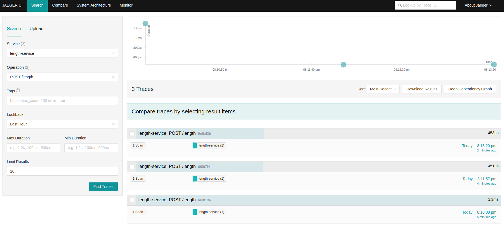
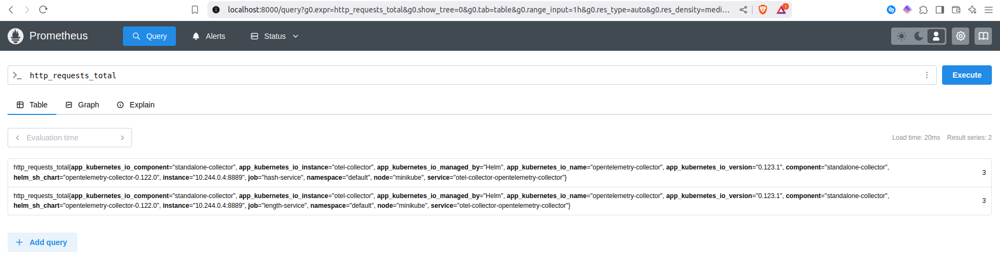
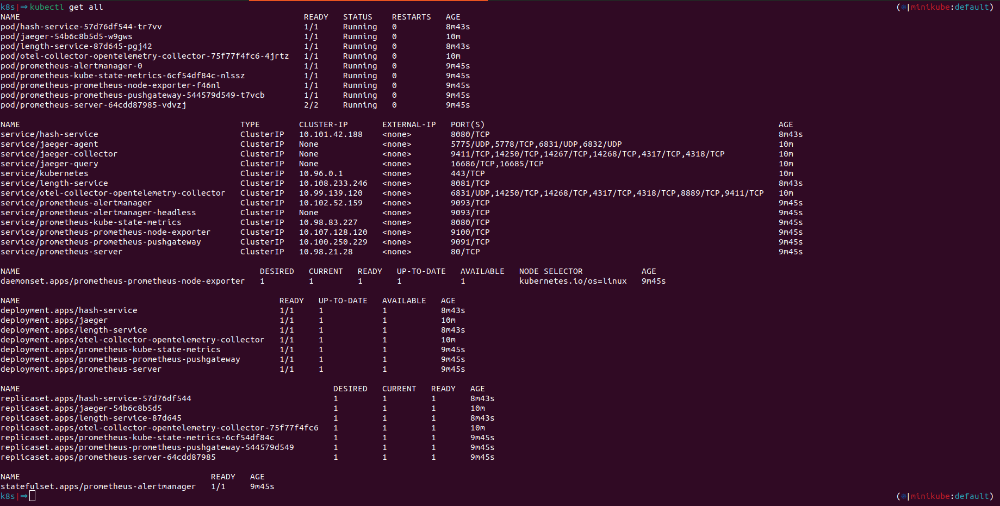

# Microservices Observability Demo

This repository contains two trivial Python services (**Hash** and **Length**) deployed to Kubernetes with full **OpenTelemetry → Collector → Jaeger / Prometheus** observability.  The goal is to showcase correct tracing & basic metrics inside a local **Minikube** cluster.

---

## 1 . Prerequisites

| Tool | Version tested |
|------|----------------|
| Minikube | v1.35.0 (Docker driver) |
| Helm | v3.17.1 |
| Docker | 28.1.0, |
| kubectl | Client Version: v1.32.2 Kustomize Version: v5.5.0 Server Version: v1.32.0 |
| Python | 3.11 |

---

## 2 . Quick Start (local)

```bash
# Clone & enter repo
 git clone <your‑repo> && cd <your‑repo>

# One‑liner to build images, install charts, apply manifests, run tests
cd ./scripts/ && bash deploy_minikube.sh
```

The script will:

1. **Build** `hash-service:latest` and `length-service:latest` and load them into Minikube’s Docker daemon.
2. **Install** Helm charts:
   * Jaeger (all‑in‑one, in‑memory)
   * Prometheus (server only)
   * OpenTelemetry Collector (deployment)
3. **Apply** Kubernetes manifests in `k8s/` for both services.
4. **Run** integration tests in `tests/` to prove endpoints work.

> **Tip:** tweak Helm values in `helm/*.yaml` to enable persistence, auth, etc.

---

## 3 . Example Requests

```bash
# Hash service
curl -X POST http://localhost:8080/hash -d "Apple"
{"hash":"f223faa96f22916294922b171a2696d868fd1f9129302eb41a45b2a2ea2ebbfd"}

# Length service
curl -X POST http://localhost:8081/length -d "Banana"
{"length":6}
```

Both services also expose `/health` for readiness/liveness.

---

## 4 . Viewing Traces & Metrics

| UI | How to open |
|----|-------------|
| **Jaeger** | browser opens `http://localhost:16686` |
| **Prometheus** | browser opens `http://localhost:9090` |

*In Jaeger* – filter by **`hash-service`** or **`length-service`** and you should see end‑to‑end traces.

*In Prometheus* – run a basic query like:
```promQL
http_requests_total
```

---

## 5 . Screenshots (add before submission)

### Sample trace in Jaeger


### Prometheus – basic metrics


### `kubectl get all` output


---

## 6 . Tear‑down

```bash
minikube delete --all --purge
```

---

### 📌  Notes & Extensions

* The Collector is configured via `helm/open-telemetry.yaml` to receive **OTLP/HTTP + gRPC** and forward traces to Jaeger; metrics are scraped by Prometheus.

